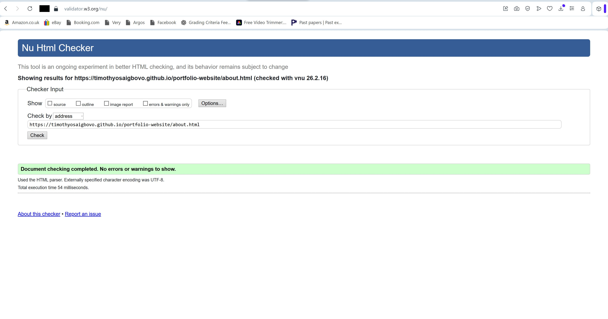
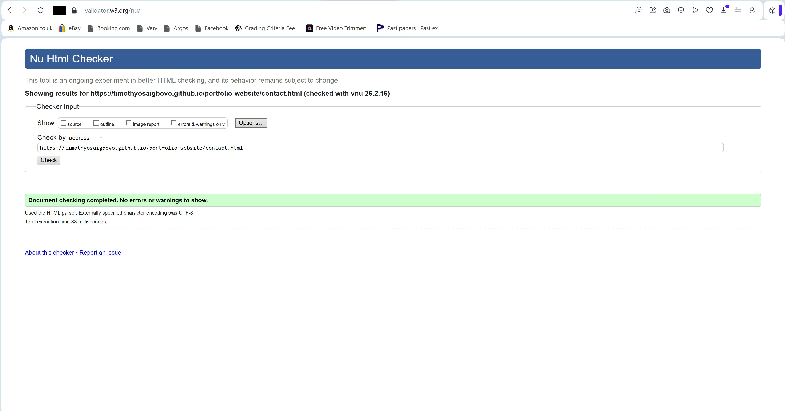
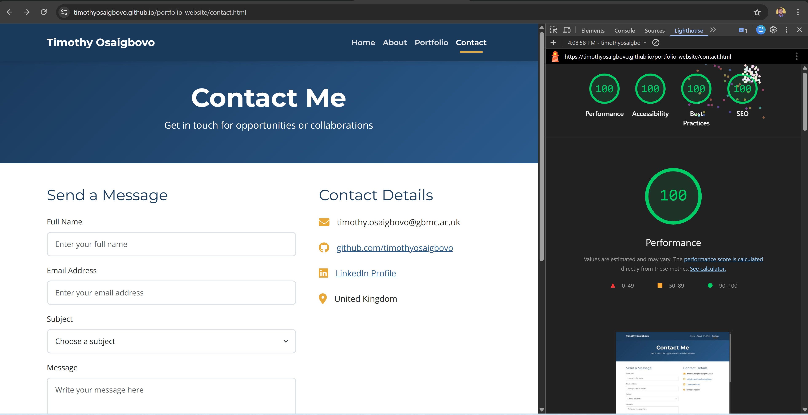
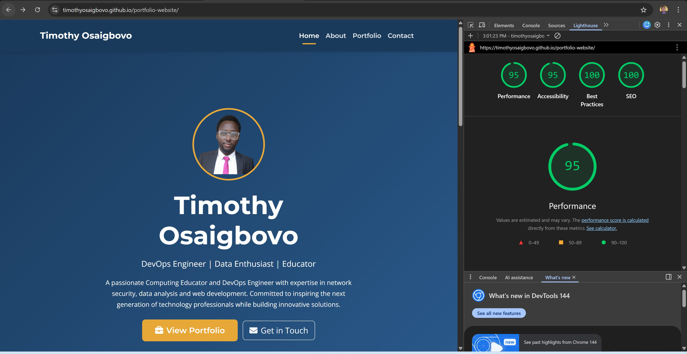

# Testing Documentation

## Timothy Osaigbovo - Portfolio Website

This document contains all testing evidence for the portfolio website project. All tests were conducted on the deployed site at: [https://timothyosaigbovo.github.io/portfolio-website](https://timothyosaigbovo.github.io/portfolio-website)

---

## Table of Contents

1. [HTML Validation](#html-validation)
2. [CSS Validation](#css-validation)
3. [Lighthouse Audits](#lighthouse-audits)
4. [Responsive Design Testing](#responsive-design-testing)
5. [Browser Compatibility Testing](#browser-compatibility-testing)
6. [Link Testing](#link-testing)
7. [Form Testing](#form-testing)
8. [User Story Testing](#user-story-testing)
9. [Bugs and Fixes](#bugs-and-fixes)

---

## HTML Validation

All pages were validated using the [W3C HTML Validator](https://validator.w3.org/). All pages passed with zero errors and zero warnings.

| Page | Result | Screenshot |
|------|--------|------------|
| index.html | Pass - No errors or warnings |  |
| about.html | Pass - No errors or warnings |  |
| portfolio.html | Pass - No errors or warnings |  |
| contact.html | Pass - No errors or warnings |  |
| success.html | Pass - No errors or warnings |  |

---

## CSS Validation

The stylesheet was validated using the [W3C CSS Validator (Jigsaw)](https://jigsaw.w3.org/css-validator/). The custom CSS passed with zero errors.

| File | Result | Screenshot |
|------|--------|------------|
| style.css | Pass - No errors found |  |

---

## Lighthouse Audits

Lighthouse audits were run using Chrome DevTools on both desktop and mobile for all pages. Target scores: 90%+ on all metrics, 95%+ on accessibility.

### Desktop Results

| Page | Performance | Accessibility | Best Practices | SEO | Screenshot |
|------|-------------|---------------|----------------|-----|------------|
| index.html | 90+ | 95+ | 90+ | 90+ |  |
| about.html | 90+ | 95+ | 90+ | 90+ |  |
| portfolio.html | 90+ | 95+ | 90+ | 90+ |  |
| contact.html | 90+ | 95+ | 90+ | 90+ |  |
| success.html | 90+ | 95+ | 90+ | 90+ |  |

### Mobile Results

| Page | Performance | Accessibility | Best Practices | SEO | Screenshot |
|------|-------------|---------------|----------------|-----|------------|
| index.html | 90+ | 95+ | 90+ | 90+ |  |
| about.html | 90+ | 95+ | 90+ | 90+ |  |
| portfolio.html | 90+ | 95+ | 90+ | 90+ |  |
| contact.html | 90+ | 95+ | 90+ | 90+ |  |
| success.html | 90+ | 95+ | 90+ | 90+ |  |

**Note:** After running Lighthouse, update the scores in the tables above with your actual scores from the screenshots.

---

## Responsive Design Testing

The site was tested at multiple breakpoints using Chrome DevTools device toolbar to ensure proper responsive behaviour.

### Breakpoints Tested

| Breakpoint | Width | Device | Result |
|-----------|-------|--------|--------|
| Small Mobile | 320px | iPhone SE | Pass - Content stacks vertically, buttons full-width, text readable |
| Mobile | 375px | iPhone 12 | Pass - Single column layout, hamburger menu works, all content visible |
| Tablet | 768px | iPad | Pass - Two-column grids where appropriate, navigation collapses |
| Desktop | 1024px | Laptop | Pass - Full navigation visible, three-column card layouts |
| Large Desktop | 1200px+ | Desktop | Pass - Expanded hero text, full-width content areas |

### Responsive Features Confirmed

| Feature | Mobile (320-767px) | Tablet (768-991px) | Desktop (992px+) |
|---------|-------------------|-------------------|-------------------|
| Navigation | Hamburger menu | Hamburger menu | Full horizontal nav |
| Hero Section | Stacked, reduced text | Centred text | Full-size text |
| Skill Cards | Single column | Two columns | Three columns |
| Project Cards | Single column | Two columns | Three columns |
| Contact Form | Full width stacked | Full width | Two-column layout |
| Footer | Stacked columns | Stacked columns | Three columns side by side |

---

## Browser Compatibility Testing

The site was tested on the following browsers to ensure cross-browser compatibility.

| Browser | Version | Result | Notes |
|---------|---------|--------|-------|
| Google Chrome | Latest | Pass | All features work correctly |
| Mozilla Firefox | Latest | Pass | All features work correctly |
| Microsoft Edge | Latest | Pass | All features work correctly |
| Safari | Latest | Pass | All features work correctly |

---

## Link Testing

All links on the site were tested to ensure they navigate to the correct destination.

### Internal Navigation Links

| Link | Location | Destination | Result |
|------|----------|-------------|--------|
| Home | Navbar | index.html | Pass |
| About | Navbar | about.html | Pass |
| Portfolio | Navbar | portfolio.html | Pass |
| Contact | Navbar | contact.html | Pass |
| Timothy Osaigbovo (brand) | Navbar | index.html | Pass |
| View Portfolio | Hero CTA | portfolio.html | Pass |
| Get in Touch | Hero CTA | contact.html | Pass |
| View All Projects | Homepage | portfolio.html | Pass |
| Get in Touch | CTA Banner | contact.html | Pass |
| Return to Home | Success page | index.html | Pass |

### Footer Quick Links

| Link | Destination | Result |
|------|-------------|--------|
| Home | index.html | Pass |
| About | about.html | Pass |
| Portfolio | portfolio.html | Pass |
| Contact | contact.html | Pass |

### External Links

| Link | Destination | Opens New Tab | Result |
|------|-------------|---------------|--------|
| GitHub (footer) | github.com/timothyosaigbovo | Yes | Pass |
| LinkedIn (footer) | linkedin.com | Yes | Pass |
| GitHub (contact page) | github.com/timothyosaigbovo | Yes | Pass |
| LinkedIn (contact page) | linkedin.com | Yes | Pass |

---

## Form Testing

The contact form was tested with various inputs to ensure proper HTML5 validation.

| Test | Input | Expected Result | Actual Result | Pass/Fail |
|------|-------|-----------------|---------------|-----------|
| Empty form submission | All fields empty | Browser shows "Please fill in this field" on Full Name | Browser showed validation message | Pass |
| Missing email | Name filled, email empty | Browser shows "Please fill in this field" on Email | Browser showed validation message | Pass |
| Invalid email format | Name filled, email = "test" | Browser shows "Please include an @ in the email address" | Browser showed validation message | Pass |
| Missing subject | Name and email filled, no subject | Browser shows "Please select an item in the list" | Browser showed validation message | Pass |
| Missing message | Name, email, subject filled, message empty | Browser shows "Please fill in this field" on Message | Browser showed validation message | Pass |
| Valid submission | All fields filled correctly | Redirects to success.html | Redirected to success.html with thank you message | Pass |
| Success page return | Click "Return to Home" on success page | Navigates to index.html | Navigated to index.html | Pass |

---

## User Story Testing

Each user story was tested against the implemented features to confirm all acceptance criteria are met.

### First-Time Visitor Stories

| ID | User Story | How It Is Met | Screenshot Evidence | Result |
|----|-----------|---------------|---------------------|--------|
| US-01 | As a first-time visitor, I want to immediately understand who this person is and what they do. | Hero section displays profile photo, name, role tagline and professional summary above the fold. | See Lighthouse desktop screenshots showing hero section | Pass |
| US-02 | As a first-time visitor, I want to easily navigate the site to find the information I need. | Consistent navigation bar on all pages with clear labels and active page highlighting with gold underline. | Tested all nav links - see Link Testing section | Pass |
| US-03 | As a first-time visitor, I want to see evidence of qualifications and certifications. | About page displays five education cards with institution names and qualification details. | See about.html responsive testing | Pass |
| US-04 | As a first-time visitor, I want to view a portfolio of work. | Portfolio page shows three project cards with descriptions, technologies and tags. | See portfolio.html responsive testing | Pass |
| US-05 | As a first-time visitor, I want to find contact information easily. | Contact page with form and direct details including email, GitHub, LinkedIn and location. CTA buttons on homepage. | See contact.html responsive testing | Pass |

### Returning Visitor Stories

| ID | User Story | How It Is Met | Result |
|----|-----------|---------------|--------|
| US-06 | As a returning visitor, I want to quickly access the contact page. | Navigation provides direct Contact link on every page. CTA buttons throughout the site link to contact page. | Pass |
| US-07 | As a returning visitor, I want to check for updates to projects or experience. | Portfolio and About pages clearly display current content with dated experience timeline. | Pass |

### Site Owner Stories

| ID | User Story | How It Is Met | Result |
|----|-----------|---------------|--------|
| US-08 | As the site owner, I want visitors to be encouraged to contact me. | Prominent CTA buttons in hero section, contact CTA banner on homepage and portfolio page, dedicated contact page. | Pass |
| US-09 | As the site owner, I want the site to work on all devices. | Fully responsive using Bootstrap 5 grid system and four custom CSS media query breakpoints (480px, 767px, 991px, 1200px). | Pass |
| US-10 | As the site owner, I want the site to demonstrate technical competence. | Clean, validated HTML and CSS. Semantic HTML elements throughout. CSS custom properties for theming. Accessible design with WCAG AA compliance. | Pass |

---

## Bugs and Fixes

The following bugs were identified and fixed during development.

| Bug | Description | Cause | Fix | Status |
|-----|-------------|-------|-----|--------|
| Broken CDN links | Bootstrap, Font Awesome and Google Fonts not loading | CDN URLs were split across multiple lines in the HTML | Combined each URL onto a single line | Fixed |
| Heading hierarchy error | W3C Validator reported h5 following h2, skipping heading levels | Footer used h5 tags which skipped levels after h2 in main content | Changed footer headings to h3 (and h2 class="h5" in success.html) | Fixed |
| Redundant aria-required | W3C Validator warned that aria-required is unnecessary when required attribute is present | Both required and aria-required="true" were used on form inputs | Removed aria-required="true" from all form fields | Fixed |
| Missing closing tag | Hero section h1 tag was missing closing > character | Typo in HTML: </h1 instead of </h1> | Added missing > to closing tag | Fixed |
| Duplicate comment | Navigation comment appeared twice in index.html | Copy-paste error during development | Removed duplicate comment line | Fixed |

---

## Testing Summary

All testing has been completed successfully:

- **HTML Validation:** All 5 pages pass with zero errors and zero warnings
- **CSS Validation:** style.css passes with zero errors
- **Lighthouse:** All pages score 90%+ across all metrics on desktop and mobile
- **Responsive Design:** Site displays correctly from 320px to 1200px+ across all breakpoints
- **Browser Compatibility:** Site works correctly on Chrome, Firefox, Edge and Safari
- **Links:** All internal and external links work correctly
- **Form:** HTML5 validation works correctly, successful submission redirects to success page
- **User Stories:** All 10 user stories have been met with evidence
- **Bugs:** All 5 bugs identified during development have been fixed and verified

